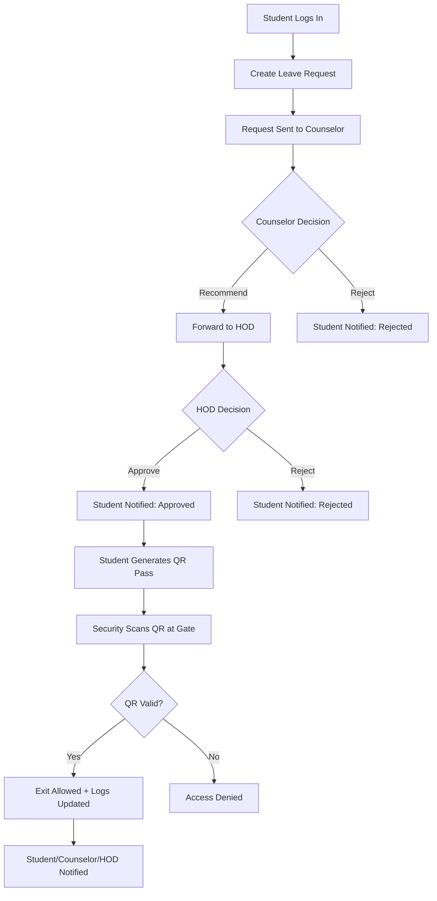

# Leave_App
📌 Workflow Overview (All Roles)
Mermaid Workflow Chart

✅ Detailed Workflow (Role-by-Role)
1. Student
Logs in to the app.
Creates a leave request by filling the form.
Waits for approval updates from Counselor and HOD.
If approved by HOD, generates a QR Pass.
Shows QR pass at the security gate.
Receives confirmation once exit is verified.
2. Counselor
Sees pending leave requests in Inbox.
Reviews the student request.
Either recommends or rejects the request.
If recommended, it moves forward to HOD.
If rejected, student is notified immediately.
3. HOD
Receives only recommended requests.
Reviews request details.
Either approves or rejects.
If approved, student can generate QR pass.
If rejected, student gets notified.
4. Security
Sees generated QR passes.
Scans student’s QR at exit.
System checks if QR is valid for exit.
If valid → exit allowed + logs updated.
If invalid → access denied message shown.
✅ Outcome
Student receives a smooth, role-based approval journey.
All approvals and actions are tracked with notifications.
Exit is controlled and verified using QR scanning.
